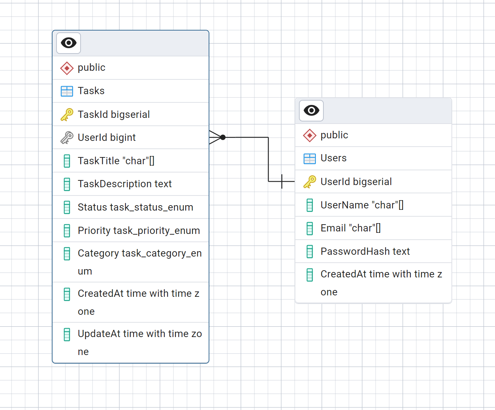

# ForDoListApp

A simple ASP.NET Core MVC To-Do List application with user management, task tracking, and role-based categorization.

---

## Table of Contents

- [Overview](#overview)
- [Features](#features)
- [Technologies](#technologies)
- [Getting Started](#getting-started)
- [Database Seeding](#database-seeding)
- [Usage](#usage)
- [Project Structure](#project-structure)
- [Contributing](#contributing)
- [License](#license)

---

## Overview

ForDoListApp is a web application designed to help users manage tasks efficiently. Users can register, log in, create, update, and categorize tasks with different priorities and statuses. This project demonstrates best practices in ASP.NET Core MVC development, session management, and Entity Framework Core usage.

---

## Features

- User registration and authentication with password hashing
- Session-based login management
- CRUD operations for tasks:
    - Task status (Pending, In Progress, Completed)
    - Task priority (Low, Medium, High)
    - Task categories (Work, Personal, Education, etc.)
- Email and input validation
- Logging for user actions
- Database seeding with sample users and tasks

---

## Technologies

- **ASP.NET Core MVC** (.NET 7 or later)
- **Entity Framework Core**
- **SQL Server** (or any EF Core-supported database)
- **C#**
- **Razor Views**
- **Serilog** / **Microsoft.Extensions.Logging**
- **Session management**

---

## Getting Started

### Prerequisites

- [.NET SDK 7.x or later](https://dotnet.microsoft.com/download)
- [SQL Server / LocalDB](https://www.microsoft.com/en-us/sql-server/sql-server-downloads) or another EF Core-compatible database
- IDE like [Visual Studio](https://visualstudio.microsoft.com/) or [VS Code](https://code.visualstudio.com/)

### Installation

1. **Clone the repository:**
     ```bash
     git clone https://github.com/gnatykdm/for-do.git
     cd ForDoListApp
     ```

2. **Configure your database connection string** in `appsettings.json`.

3. **Apply migrations and seed the database:**
     ```bash
     dotnet ef database update
     ```

4. **Run the application:**
     ```bash
     dotnet run
     ```

5. Open your browser and navigate to `https://localhost:5001` (or the URL shown in the console).

---

## Database ERD




## Database Seeding

The app seeds the database with initial users and tasks for testing:

- Users: `alice`, `bob`, `charlie`, `diana`, `eve`
- Sample tasks assigned to these users

Seeding occurs automatically if the database is empty.

---

## Usage

- Register a new account or log in with seeded users (`alice`, `bob`, etc.)
- Create, edit, and track tasks with different priorities and statuses
- Log out to end your session

---

## Project Structure

```
Controllers/         # MVC Controllers for HTTP requests
Models/Entity/       # Entity classes for database tables
Models/Service/User/ # Business logic related to users
Data/                # EF Core database context and seeders
Views/               # Razor views for UI
Utils/               # Utilities (e.g., password hashing)
wwwroot/             # Static files (CSS, JS)
```

---

## Contributing

Contributions are welcome! Feel free to open issues or submit pull requests.

Please make sure to update tests as appropriate.

---

## License

This project is licensed under the MIT License - see the [LICENSE](LICENSE) file for details.

---

*If you want, I can help generate other docs like API docs, architecture overview, or deployment instructions!*
